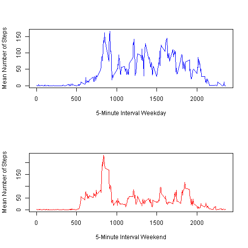

# Reproducible Research: Peer Assessment 1
This project is the Peer Assessment 1 for the Rerproducible Research Data Science course.  The input activity data for this project was retrieved from [https://d396qusza40orc.cloudfront.net/repdata%2Fdata%2Factivity.zip](https://d396qusza40orc.cloudfront.net/repdata%2Fdata%2Factivity.zip) on Aug 13, 2014 at 8am EDT.

## Loading and preprocessing the data


```r
#read in the input activity data into a data frame
activity <- read.csv("activity.csv",header=TRUE, sep=",")
```

## What is mean total number of steps taken per day?


```r
#get a data frame with the total steps for each day
steps_day <- aggregate(steps ~ date, activity, sum)

#plot histogram of the total steps per day
hist(steps_day[,c('steps')], col="lightblue", main="Histogram of Total Steps Per Day", xlab="Total Steps")
```

 

#### Mean Steps Per Day:

```r
#calculate the mean number of steps per day
mean(steps_day[,c('steps')])
```

```
## [1] 10766
```
#### Median Steps Per Day:

```r
#calculate the median number of steps per day
median(steps_day[,c('steps')])
```

```
## [1] 10765
```

## What is the average daily activity pattern?


```r
#get the mean number of steps per 5-minute interval across all days
steps_interval_mean <- aggregate(steps ~ interval, activity, mean)

#plot the mean number of steps per 5-minute interval
plot(steps_interval_mean$interval,steps_interval_mean$steps, type="l", xlab="5-Minute Interval", ylab="Mean Number of Steps", main="Mean Number of Steps per 5-Minute Interval", col="blue")
```

 

## Imputing missing values
#### Total number of missing values:

```r
#get number of NA values
length(activity$steps[is.na(activity$steps)])
```

```
## [1] 2304
```
#### The impute the missing values I chose to set a missing value to the mean (across all days) of its corresponding 5-minute inverval.


```r
#create new dataframe with missing values populated with the average for that interval
activity2 <- activity
for(i in seq_along(activity2$steps)){
    row <- activity2[i,]
    if(is.na(row$steps)){
        activity2[i,]$steps <- steps_interval_mean[steps_interval_mean$interval==row$interval,]$steps
    }
}
```
#### Create new data fram with imputed missing values and plot histogram

```r
#get a data frame with the total steps for each day
steps_day2 <- aggregate(steps ~ date, activity2, sum)

#plot histogram of the total steps per day
hist(steps_day2[,c('steps')], col="lightblue", main="Histogram of Total Steps Per Day with Imputed Missing Values", xlab="Total Steps")
```

 

#### Mean Steps Per Day with Imputed Missing Values:

```r
#calculate the mean number of steps per day
mean(steps_day2[,c('steps')])
```

```
## [1] 10766
```
#### Median Steps Per Day with Imputed Missing Values:

```r
#calculate the median number of steps per day
median(steps_day2[,c('steps')])
```

```
## [1] 10766
```
#### Comparison of data with missing values vs. data with imputed values
The mean is the same, 10766.  The median with missing values is 10765, but with imputed values is 10766 which matches the mean.  The historgram with imputed values has higher frequencies for the steps groups which makes sense since there are more records with data values.

## Are there differences in activity patterns between weekdays and weekends?

```r
#separate data into weekday and weekend
activity2$weekday <- weekdays(as.POSIXct(strptime(activity2$date, "%Y-%m-%d")))
activity_weekday <- activity2[activity2$weekday=="Saturday" | activity2$weekday=="Sunday",]
activity_weekend <- activity2[activity2$weekday!="Saturday" & activity2$weekday!="Sunday",]
steps_interval_mean <- aggregate(steps ~ interval, activity, mean)
steps_interval_mean_weekday <- aggregate(steps ~ interval, activity_weekday, mean)
steps_interval_mean_weekend <- aggregate(steps ~ interval, activity_weekend, mean)

#plot weekday and weekend averages
par(mfrow=c(2,1))
plot(steps_interval_mean_weekday$interval,steps_interval_mean_weekday$steps, type="l", xlab="5-Minute Interval Weekday", ylab="Mean Number of Steps", main="", col="blue")
plot(steps_interval_mean_weekend$interval,steps_interval_mean_weekend$steps, type="l", xlab="5-Minute Interval Weekend", ylab="Mean Number of Steps", main="", col="red")
```

 

The average number of steps has a higher spike in the morning for weekend intervals, but then is generally lower during weekend intervals for the rest of the day, in comparison to weekday intervals.

